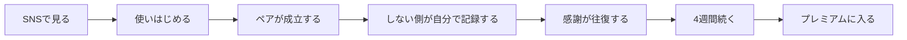

# 事業計画

本書は saborine を事業として成立させるための計画である。企画書(docs/product.md)の設計原則を上位規範とし、「何で稼ぐか」「いくらで売るか」「どれだけ集まれば黒字になるか」「うまくいかないと判断する基準は何か」を定める。広告費はゼロ、運営はオーナー1人とAIエージェントという前提を貫く。

## 稼ぎ方の基本方針

このアプリの価値は「家事が回ること」ではなく「ふたりの間を感謝が行き来したこと」である。したがって売るものも、家事の便利さではなく、**行き来した感謝がふたりに残した思い出**にする。

売る前に、売らないものを先に決める。次の4つは、収益が伸びるとしても恒久的に扱わない。

| 売らないもの | 理由 |
| :-- | :-- |
| ごはん・成長ポイント・進化 | お金で買えるなら家事をする理由が消える。プロダクトの存在意義そのものが崩壊する(企画書の設計原則) |
| 中核機能の制限による課金誘導 | 記録・ありがとう・通知・キャラクターの成長は、無料のままで完全に一周する。輪の途中に料金所を置くと、招待された側が「お金を要求された」と感じ、両面採用が崩れる |
| 広告 | ふたりの時間に他人の都合を割り込ませる。「誰も責めない」静かな世界観と両立しない |
| 利用データの外部提供 | 家庭内の記録という性質上、二次利用は信頼を一度で失う |

売るものは2つに絞る。どちらも**家事の量にも成長の速さにも一切影響しない**。

| 売るもの | 中身 | なぜ払えるか |
| :-- | :-- | :-- |
| 思い出 | 過去の週次カードをすべて見返せるアルバム、月に一度の振り返りムービー、進化の記念カード | 積み上がった時間そのものが価値になる。使うほど手放しにくくなり、続けるほど払う理由が強くなる |
| 見た目 | 季節の衣装、部屋の模様替え、サボリーヌの小物 | かわいさは動機の中心であり、着せ替えは「ふたりで選ぶ」共同作業そのものになる |

### 誰が払うか: ペア単位で1つ

料金はユーザー単位ではなく**ペア単位**とする。どちらか一方が支払えば、ふたりの画面に等しく効く。

理由は3つある。第一に、ふたりでひとつのキャラクターという世界観と一致する。第二に、「あなたも払って」という交渉が発生しない。招待される側にお金の負担を求めた瞬間、ゼロ負担・ゼロ非難という入口の設計が壊れる。第三に、解約にふたりの合意が要らないため、やめたい人がやめられなくなる状況を作らない。

## 商品と価格

| 商品 | 形態 | 価格(ペアで1つ) | 提供開始 |
| :-- | :-- | :-- | :-- |
| サボリーヌ・プレミアム | 月ごとの自動更新 | 680円 / 月 | 正式版公開の翌月 |
| サボリーヌ・プレミアム | 年ごとの自動更新 | 4,800円 / 年(月あたり400円) | 同上 |
| 1年のふたりの物語 | 一度きりの購入 | 4,800円 | 正式版公開から1年後 |

価格の根拠を示す。国内のアプリで課金の成立しやすい帯は月480〜1,500円とされる。ペアで680円はひとりあたり340円であり、この帯の下寄りに収まる。年額は月額比で41%引きとし、こちらを主軸に置く。思い出は時間とともに積み上がる商品であるため、期間が長いほど価値が増し、記念日という区切りとも相性が良い。

「1年のふたりの物語」は、1年ぶんの記録をふたりの物語として1本のムービーと1冊の本に仕立てる、記念日向けの単発商品である。利益率は低いが、それ自体がSNSで共有される素材になり、宣伝費をかけない事業の宣伝装置として働く。正式版が1年ぶんの記録を蓄えてから始める。

無料のままでも、記録・ありがとう・キャラクターの成長・週次カードの受け取り・通知はすべて使える。プレミアムが増やすのは、過去を見返す範囲と、着せ替えの選択肢だけである。

## 費用の構造

支出は次のとおりで、利用者数にほとんど比例しない。

| 費目 | 金額 | 備考 |
| :-- | :-- | :-- |
| Apple Developer Program | 15,000円 / 年 | 参加済み |
| データベース(Turso) | 750円 / 月 | 無料枠(5GB・月5億行の読み取り)で当面足りる。有料化しても Developer プランで足りる |
| 配信とサーバー(Cloudflare) | 750円 / 月 | 無料枠(1日10万リクエスト)で当面足りる |
| 独自ドメイン | 2,000円 / 年 | |
| 広告費 | 0円 | オーナー決定によりSNSのオーガニック運用のみ |
| **年間の実費合計** | **約 4.0万円** | 有料プランへ移行しきった場合の上限値 |

App Store の手数料は15%とする(Apple Small Business Program。前年の受取額が100万ドル未満の開発者が対象で、新規参加者も適用される)。よって年額プランの手取りは1ペアあたり4,080円、月額プランは578円となる。

利用者が増えても費用がほぼ増えない一方、収入は課金ペア数に比例する。この形が、宣伝費をかけない小規模運営でも黒字に届く根拠である。

## 黒字化までの筋道

黒字化を2段階に分けて定義する。

### 段階1: 実費の黒字化

年間の実費4.0万円を、継続的な収入が上回る状態。**年額プランの課金ペアが10組**で到達する。

正式版の公開時点で数百組が使っていれば、課金率が数パーセントでも十分に届く水準である。ここは事業の存続条件であり、達成できるかどうかを議論する段階ではなく、公開後まもなく通過すべき地点として扱う。

### 段階2: 事業としての黒字化

オーナーが自分の時間をこの事業に充てることに、経済的な説明がつく状態。基準を**月商50万円(年商600万円)**と置く。

必要な規模は次のとおり計算する。

| 前提 | 値 |
| :-- | :-- |
| 1ペアあたりの年間手取り(年額プラン) | 4,080円 |
| 必要な課金ペア数 | 600万円 ÷ 4,080円 ≒ **1,470組** |
| 課金率(継続して使っているペアのうち払うペアの割合) | 5%を目標とする |
| 必要な継続ペア数 | 1,470 ÷ 5% ≒ **29,400組(約59,000人)** |

課金率5%の置き方を説明する。無料でも中核が完全に使えるアプリ(フリーミアム)の課金転換率は、業界の中央値で2.1%とされる。saborine はこれを上回る前提を置く。理由は、支払いがペア単位で心理的な単価が半分になること、そして商品が「積み上がった思い出」であり、続けているペアほど手放しにくくなるためである。ただしこれは仮説であり、課金導入後の実測で置き換える。課金率が3%に留まる場合、必要な継続ペア数は49,000組(約98,000人)となる。

段階2は1年で届く数字ではない。SNSのオーガニック運用は立ち上がりに数ヶ月から年単位を要するのが通例であり、段階2は「2年目に狙う地点」として置く。

## 事業の指標

### 北極星指標

事業の健康状態を1つの数で見るなら、**その週に感謝が往復したペアの数**とする。

売上でも、インストール数でも、記録の回数でもない理由は3つある。第一に、感謝の往復が起きた週は、ふたりの関係に実際に価値が生まれた週である。第二に、これは片側だけの利用では成立しないため、この事業の最大の難所である両面採用の成否をそのまま映す。第三に、続けるかどうかも、いずれ払うかどうかも、この体験が起きているかに従う。先に価値を数え、売上は結果として数える。

### ファネル

各段の目標値を置く。ベータ判定と公開後の実測で置き換える、現時点の仮置きである。

| 段 | 指標 | 仮置きの目標 | この数字が崩れたときに疑うもの |
| :-- | :-- | :-- | :-- |
| 使いはじめる | 事前登録またはLP訪問から登録完了まで | 40% | 登録の重さ、最初の1分の体験 |
| ペアが成立する | 登録したペアのうち、相手が受諾した割合 | 50% | 招待の手紙の文面と渡し方(最大の山場) |
| しない側が自分で記録する | 成立したペアのうち、7日以内に転換した割合 | 60% | 促しの仕掛け、バランス報酬の伝わり方 |
| 感謝が往復する | 成立したペアのうち、同じ日に双方向の感謝が起きた割合 | 50% | 通知の届き方、記録のハードル |
| 4週間続く | 成立したペアのうち、4週後も週1回以上使っている割合 | 35% | 飽き、キャラクターの表現力、ウィジェットの不在 |
| プレミアムに入る | 続いているペアのうち有料になった割合 | 5% | 商品の中身と価格 |

個人別の集計を作らない原則は、事業指標にも適用する。集計はすべてペア単位で数え、「どちらが何回やったか」を比べる数値は運営側でも作らない。

## 進め方

| 時期 | やること | 完了の判断 |
| :-- | :-- | :-- |
| 2026年8月中 | MVPの実装完了と本番公開(Web版) | 実カップルがURLだけで一周できる |
| 2026年8月〜9月 | ベータテスト(5組の7日間 + 個別インタビュー10人) | docs/beta.md の判定シートで仮説1と2が成功 |
| 2026年9月 | SNS開設と事前登録LPの公開、週4本の投稿を開始 | 開設30日で仮説5の判定材料が揃う |
| 2026年9月〜10月 | ホーム画面ウィジェット(V1.1)とiOSネイティブ版 | 「都度開くのが面倒」への回答が実機で動く |
| 2026年10月〜11月 | App Store への申請と正式版公開(無料) | 審査通過 |
| 2026年12月 | プレミアムの提供開始 | 段階1(実費の黒字化)を通過 |
| 2027年 | SNSと口コミによる拡大、「1年のふたりの物語」の提供開始 | 段階2(月商50万円)を狙う |

ベータの判定で仮説1または2が失敗した場合、この表の以降の予定はすべて後ろに倒し、招待の文面・入口体験・転換の仕掛けを作り直して再検証する。これは docs/mvp.md の規定に従う。

## やめる基準・変える基準

事業を続けるかどうかの判断を、あらかじめ数字で決めておく。感触ではなく基準で判断するためである。

| 状況 | 判断 |
| :-- | :-- |
| ベータで仮説1(招待)または仮説2(転換)が失敗 | 機能開発を止め、招待と転換だけを作り直して再検証する。3回作り直しても届かない場合、コンセプトそのものを見直す |
| 正式版公開から3ヶ月、ペア成立率が30%未満 | 招待体験の作り直しを最優先とする。他の開発を止める |
| 正式版公開から6ヶ月、4週継続率が15%未満 | キャラクターの表現力(Rive導入)とウィジェットに投資を集中する。それでも動かなければ、飽きへの根本的な打ち手がないと判断する |
| プレミアム提供から6ヶ月、課金率が1%未満 | 商品の中身を入れ替える。価格を下げるのではなく、売るものを見直す |
| 公開から12ヶ月、段階1(実費の黒字化)に未到達 | 事業としての継続可否をオーナーが判断する |

一方で、次の理由では方針を変えない。SNSの数字が1〜2ヶ月伸びないこと、競合が同種の機能を出すこと、単月の売上が前月を下回ることである。オーガニック運用と口コミの立ち上がりは非線形であり、短期の変動で舵を切ると、積み上げが毎回ゼロに戻る。
