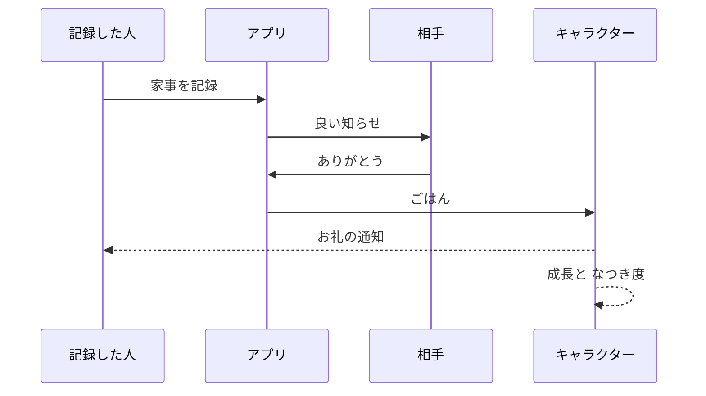
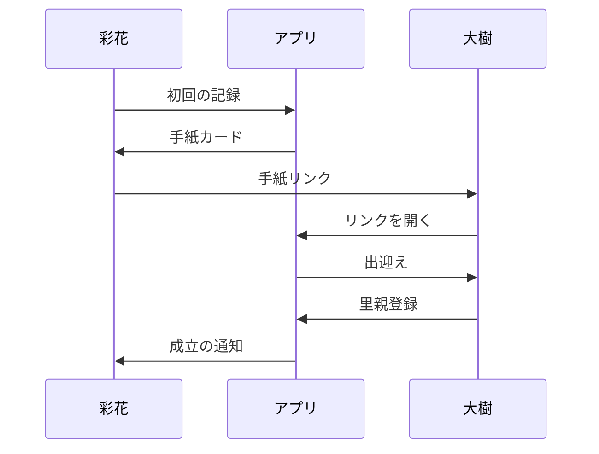
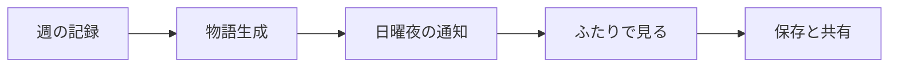
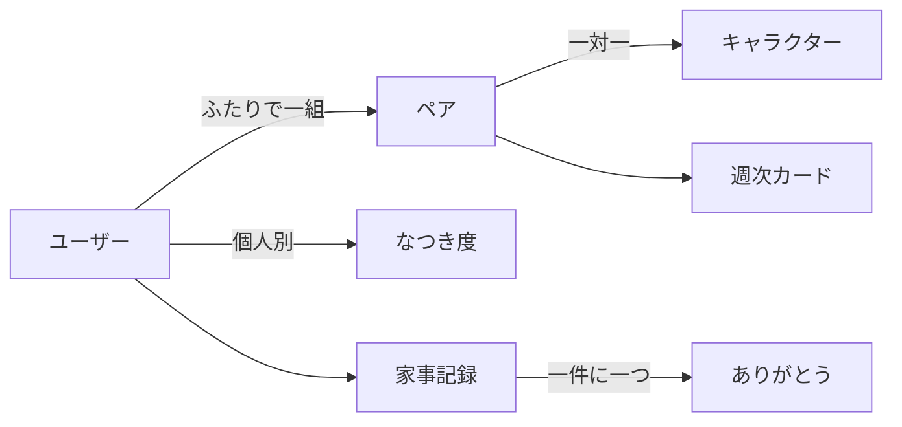

# カスタマージャーニーとMVP要件

本書は企画書(docs/product.md)のロードマップ第4段階「カスタマージャーニーとMVP要件定義」の成果物である。企画書のコンセプト・設計原則(罰なし、催促はキャラクターから、個人別比較を持たない、通知は良いことだけ)を上位規範とし、すべての要件はそこから逆算する。要素は最小を貫き、画面は5つ、通知は4種類、成長の計算式は1本に収める。

## カスタマージャーニー

企画書の最重要課題「両面採用」に対応し、ジャーニーを2本に分けて設計する。ジャーニーAは不満を持つ「する側」がアプリを見つけて相手を招待するまで、ジャーニーBは招待された「しない側」が習慣化するまでを扱う。Aの山場は「招待を切り出す瞬間」、Bの山場は「初めて自分が記録する転換点」である。

### ジャーニーA: する側(彩花・発見〜招待)

彩花(27歳・同棲1年・ルール形成期)を主人公とする。彼女の最大のリスクは、アプリを見つけることではなく、招待が「あなたは家事をしていない」という非難として大樹に届いてしまうことである。

| 段階 | 行動 | タッチポイント | 思考・感情 | 障壁 | アプリ側の打ち手 |
| :-- | :-- | :-- | :-- | :-- | :-- |
| 発見 | SNSの短い動画や友人が共有した週次カードで、ふたりで育てるキャラクターを見る | TikTok / Instagram / 共有された週次カード | 「かわいい。うちのことだ」 | 「家事アプリ」と分かった瞬間に管理っぽさを感じて引く | 見せる順番をキャラクター→ふたりの物語→家事の順にする。共有された週次カード自体が広告になる |
| インストール | App Storeから入れて、名前だけで開始。キャラクターの苗を迎える | App Store / アプリ初回画面 | 「登録が軽い。とりあえず触ってみよう」 | 入力項目やメール認証が多いと離脱する | 登録は名前のみ。開始から1分以内に「記録→キャラクターが反応する」までを体験させる |
| ひとり期間 | 数日ひとりで家事を記録し、キャラクターに愛着が湧く | アプリ | 「かわいい。でもひとりだと物足りない」 | ありがとうが来ないため、報酬の輪が完成しない | ひとりでもなつき度は育つ。ただし「ごはんはパートナーのありがとうからしか生まれない」と画面で示し、招待の動機を自然に作る |
| 招待を切り出す | キャラクターからの手紙カードを大樹に送る、または対面で画面を見せる | LINE / 対面 | 「送りたい。でも責めてるって思われたら怖い」 | 招待が非難のメッセージとして受け取られるリスク(本ジャーニー最大の山場) | 次項で詳細設計 |
| ペア成立 | 大樹が受諾し、自分の過去の記録に初めてありがとうが届く | 通知 / アプリ | 「見てくれた。わかってくれた」 | 受諾までの待ち時間に不安が募る | 成立したときだけ良い通知を送る。未受諾状態の表示や催促は一切しない |

#### 山場の設計: 招待を切り出す瞬間

この瞬間の課題は、招待という行為そのものが「私は困っている、あなたが原因だ」という含意を持ってしまうことである。打ち手の核心は、招待の主語を彩花からキャラクターに移し替えることにある。

- 招待はキャラクターからの手紙にする。彩花のお願いではなくキャラクターのお願いという構図にする
- 文面は3行以内に収める(例: 「ぼく、サボリーヌ。いま里親がひとりだけなんだ。もうひとりの里親に、なってくれる?」)。受け手は文章を読むこと自体を面倒に感じる前提に立ち、長文を渡さず、キャラクターの姿と表情に語らせる
- 手紙の文面に家事・分担・不満に類する言葉を一切入れない。「一緒に里親になろう」だけで完結させる
- 送信前に手紙のプレビューを彩花に見せる。「これなら責めていると思われない」と彩花自身が確認できることが、送るボタンを押せる条件になる
- 手紙リンクの送付に加えて、「一緒にいるときに画面を見せて誘うのもおすすめ」と添える。対面で笑いながら見せる導線は、文章よりさらに非難のリスクが低い
- 断られても誰も傷つかない設計にする。開封状態や未受諾を表示せず、成立したときだけ通知する。招待カードの再提示は初回記録直後と3日後の2回までとし、それ以上アプリからも促さない

### ジャーニーB: しない側(大樹・受諾〜習慣化)

大樹(28歳)は現状に不満がなく、課題解決の動機を持たない。したがって最初の7日間は「何かをさせられる」体験を徹底的に排除し、「与える(ありがとうを送る)→自分もやってみる→認められる」の順で自然に転換させる。日単位で設計する。

| 日 | 大樹の体験 | アプリ・キャラクターの動き | 狙い |
| :-- | :-- | :-- | :-- |
| 0日目(受諾) | リンクを開くとキャラクターが出迎える。名前だけで登録し、画面に出ている彩花の直近の記録に1タップでありがとうを送る。キャラクターがごはんを食べて喜ぶ | タスク・目標・約束を一切求めない。初回体験は「感謝を1回送る」だけで完結する | 入口をゼロ負担・ゼロ非難にする(企画書の両面採用原則) |
| 1日目 | 「彩花が『お皿洗い』をしてくれたよ」の通知を受け、ありがとうを返す | なつき度が上がり、キャラクターが大樹の方を向くようになる | 通知→開く→1タップ、という最小の習慣の種をまく |
| 2日目 | アプリを開くと、キャラクターがひとこと「ゴミ出しでもごはんになるんだって」とつぶやいている | 促しは画面内のセリフのみ。プッシュ通知にはしない | 「自分もやればこの子に食べさせられる」という気づきを作る |
| 3日目(転換点) | 初めて自分で家事を記録する。彩花からすぐありがとうが届き、キャラクターが初めて大樹の名前を呼ぶ | 初記録には特別な演出(はじめてのごはんの記念)を用意する | 「やったら認められた」という、現実では得られなかった体験を最短で成立させる |
| 4日目 | 記録を続けると、バランスゲージがよく動くことに気づく | 「きみの1回はいまいちばん栄養になる」とキャラクターが伝える | 貢献が少ない側ほど1回が効く実感(バランス報酬の効用)を渡す |
| 5日目 | 同じ日のうちに、ありがとうが初めて双方向に交わされる | キャラクターが両者に喜びの反応を返す | KPI「感謝の往復率」の初回成立 |
| 6日目 | なつき度のしきい値に達し、新しい仕草(近寄ってくる)が解放される | 大きな報酬ではなく、小さな変化を見せる | 翌日の週次カードへの期待を温める |
| 7日目(日曜夜) | 「はじめての1週間」の週次カードが届き、ふたりで一緒に見る | 物語形式で1週間を振り返る。個人別の集計表は出さない | 続ける理由を「数字」ではなく「ふたりの思い出」として渡す |

#### 転換点の設計

「感謝を送るだけの人」から「自分も記録する人」への転換は、次の3つの仕掛けで自然に起こす。いずれも人からの催促を使わない。

1. 促しの主語と場所を限定する。促すのはキャラクターだけ、場所はアプリ内だけとする。通知で促さないため、催促と受け取られる余地がない。ただし文字のセリフだけでは認知されないため、視線を集める動き(サボリーヌが跳ねる、記録ボタンの方を見る)と必ずセットで提示する
2. 1回の価値を非対称にする。後述の成長計算式により、貢献が少ない側のごはんは多い側の3倍の栄養になる。「少ないことが責められる理由」ではなく「自分の1回が最も効く理由」に反転する
3. 記録のハードルを最小にする。プリセットから1タップ、写真・詳細・相手の承認は不要とする。プリセットは最近使った順に並べ、粒度はプリセット6種+自由入力1枠を保つ(細かすぎる分類はそれ自体が面倒になる)。記録の入口は記録ボタンに加えてサボリーヌ自身にも置く(タップすると「なにかしてくれた?」と聞く)

## MVP要件

企画書のMVP5要素(ワンタップ記録・ありがとうスタンプ・ふたりでひとつのキャラクター・ペア招待・週次カード)を、実装可能な粒度に落とす。

### 画面一覧

画面は5つに収める。生活の中心はホーム1画面であり、他はその出入口にすぎない。

| 画面 | 役割 | 主要素 |
| :-- | :-- | :-- |
| はじめかた | 初回登録と、招待の送付・受諾を担う | 名前入力(登録はこれのみ)、キャラクターとの出会い演出、招待の手紙カード送付、招待リンクからの受諾 |
| ホーム | 日常のすべてが起こる場所 | キャラクター(仕草・セリフ)、バランスゲージ、記録ボタン、相手の直近の記録とありがとうボタン |
| 記録シート | ホームから開く家事の記録 | プリセット家事一覧(1タップで完了)、自由入力1枠 |
| 週次カード | 1週間の物語をふたりで見る | 物語カード(本文5行以内、絵が主役)、保存、共有 |
| 設定 | 最小限の管理 | 通知のオン・オフ、キャラクターの名前変更、ペア解除、アカウント削除 |

### 主要フロー

中心となる報酬の輪は「記録→通知→ありがとう→ごはん→成長」である。報酬(ありがとう)は必ずパートナー本人から発生し、アプリはそれを運ぶだけに徹する。

招待は「家事の話をしない手紙」として流れる。未受諾の状態は誰にも表示しない。

週次カードは毎週日曜夜に自動で生まれる。集計表ではなく物語である。

### 通知仕様

設計原則「通知は良いことが起きたときだけ」「催促はキャラクターから」を通知仕様に翻訳すると、プッシュ通知は4種類のみ、促しはプッシュ通知に含めない、となる。未読・放置・無反応を理由とする通知は存在しない。

| 種類 | 宛先 | 文言例 | タイミング |
| :-- | :-- | :-- | :-- |
| 記録のお知らせ | 相手 | 「彩花が『お皿洗い』をしてくれたよ」(開くと1タップでありがとうを送れる) | 記録の直後。1時間以内の連続記録は1通にまとめる |
| ありがとうのお届け | 記録した本人 | 「大樹からありがとうが届いたよ。ごはん、おいしかった!」 | ありがとうの直後 |
| 成長のお知らせ | ふたり | 「みてみて、ちょっと大きくなったよ」 | 進化・仕草の解放時のみ |
| 週次カード | ふたり | 「今週のふたりのお話ができたよ」 | 毎週日曜21時 |

補足の規則は次の2つである。促し(「ゴミ出しでもごはんになるんだって」等)はアプリを開いたときのキャラクターのセリフとしてのみ表示し、プッシュ通知では送らない。深夜(22時〜翌8時)に発生した通知は翌朝にまとめて届ける。

プッシュ通知はWeb版でも提供する(Web Push)。iOSでは「ホーム画面に追加」した場合のみ届くため、オンボーディングに「サボリーヌのおうちをホーム画面につくろう」という誘導を必須ステップとして置く(ホーム画面のアイコン常駐は「都度アプリを開くのが面倒」の緩和も兼ねる)。追加していない環境ではアプリ内バナーで代替する。

### キャラクター成長ロジック

計算式は1本に絞る。用語は、ありがとう1件=ごはん1つ、A=一方の家事に届いたごはん数、B=他方の家事に届いたごはん数(いずれも週内)とする。

週の成長ポイントは次式で決める。

> 成長ポイント = (A + B) + 2 × min(A, B)

「ふたり分そろったごはんは栄養が3倍」という一言で説明できる。片方だけが10個集めると10ポイント、5個ずつなら20ポイントとなり、企画書の「片方が10回やるより5回ずつの方がよく育つ」を最小の式で実現する。副次効果として、貢献が少ない側の1個は3ポイント、多い側の1個は1ポイントの価値を持ち、「する側は相手を誘う方が合理的」「しない側は自分の1回が最も効く」という両面の行動変化が同じ式から導かれる。

| 要素 | 仕様 | 罰なし原則との整合 |
| :-- | :-- | :-- |
| バランスゲージ | 直近7日の min(A,B) ÷ max(A,B) を「ふたりの息ぴったり度」として1本のゲージで表示する。回数の数字は画面に出さない | 数字の対決ではなく風景として差を見せる |
| なつき度 | 個人別。自分の記録1回またはありがとう送信1回で +1。累計 5 / 20 / 50 / 100 で仕草(こちらを向く→名前を呼ぶ→近寄ってくる→特別な仕草)を解放する | 減らない。放置しても失われない |
| だらしなモード | ふたりとも記録が3日途切れると、サボリーヌがだらしない姿になる(ぐうたら寝転がる・寝ぐせ・おもちゃの散らかし)。どちらか1回の記録で即座にしゃきっと戻る | 衰弱・悲しみ・死ではなく、飼い主の鏡としての笑える愛嬌。誰のせいかは一切示さず、復帰は1回で即時のため罪悪感を溜めない |
| 進化 | 月末に当月の成長ポイントが20以上なら進化する。分岐は当月最大の指標で決める: 息ぴったり度→調和系、感謝が往復した日数→花さき系、どちらかが記録した日数→こつこつ系(同点は調和系)。20未満の月は翌月に持ち越し、キャラクターは元気に昼寝して過ごす | 3分岐はすべて肯定的な姿。進化しないことは失敗ではなく「ゆっくり育つ」 |

### データモデル案

持つデータを7つのまとまりに限定し、持たないデータを明文化する。実装技術には踏み込まない。

| エンティティ | 内容 | 主な項目 |
| :-- | :-- | :-- |
| ユーザー | 里親ひとり分 | 名前、通知設定 |
| ペア | ふたりの結びつき | ユーザー2名、成立日、招待リンクの合言葉 |
| キャラクター | ペアに1体 | 名前、累計成長ポイント、進化の段階と系統 |
| なつき度 | ユーザーとキャラクターの関係 | ユーザー、累計値 |
| 家事記録 | ワンタップ記録1件 | 記録したユーザー、家事の種類、日時 |
| ありがとう | 記録1件につき最大1つ | 対象の記録、送ったユーザー、日時 |
| 週次カード | 週の物語 | ペア、対象週、物語文 |

持たないデータを明記する。個人別の累計回数を比較できる集計(「私は32回、あなたは6回」)は、画面だけでなく保存データとしても作らない。バランスゲージは直近7日の記録からその場で計算し、数値としては見せない。既読・未読・放置日数など、責める材料になり得る状態も記録しない。

### スコープ外

削る判断を明確にするため、「V2以降に送るもの」と「設計原則により恒久的に作らないもの」を区別して列挙する。

| 区分 | 項目 | 理由 |
| :-- | :-- | :-- |
| V2以降 | 課金機能一式(限定衣装・部屋の装飾・思い出ムービー・フォトブック) | まず無料の輪が回ることを検証してから載せる |
| V2以降 | Android版 | 企画書のとおりiPhone先行 |
| V1.1 | ホーム画面ウィジェット(サボが常駐し、アプリを開かずに眺める・記録する) | 「都度アプリを開くのが面倒」という核心的な摩擦への本命。ネイティブ拡張が必要なため、報酬の輪が回ることを確認してから最優先で載せる |
| V2以降 | 家事プリセットの編集・並べ替え | MVPはプリセット(最近使った順)+自由入力1枠で足りる |
| V2以降 | 週次カードのアルバム(過去一覧) | MVPは端末への保存・共有で代替する |
| V2以降 | 週次パルス(2問アンケート)のアプリ内実装 | ベータ期間は運営からの手動アンケートで測る |
| 作らない | タスク割当・人からの催促・リマインダー | アプリが「口うるさい側」の代理人になるため(設計原則) |
| 作らない | 個人別スコアの比較・ランキング・履歴の突き合わせ | 恨みの帳簿になるため(設計原則) |
| 作らない | キャラクターの衰弱・死・減点 | 罰は回避とアンインストールを生むため(設計原則) |
| 作らない | 家事を代替できる課金(お金でごはんを買う) | 家事をする理由が消え、存在意義が崩壊するため(設計原則) |

## 検証計画

プロトタイプ段階で検証すべき仮説を、事業リスクの大きい順に5つ定義する。上位2つ(招待と転換)は両面採用の成否そのものであり、ここが崩れたら機能を作り込んでも意味がない。

| 順位 | 仮説 | 検証方法 | 成功基準 |
| :-- | :-- | :-- | :-- |
| 1 | 招待仮説: 家事に触れない「里親の手紙」なら、現状に不満のない「しない側」でも招待を受け入れる | 手紙カードと受諾画面のモックを、大樹型の条件(同棲・共働き・家事分担に不満なし)に合う10人に提示し、受けるか・どう感じたかを聞く | 10人中8人以上が「受ける」と回答し、「責められている感じがする」という反応が0件 |
| 2 | 転換仮説: 感謝を送るだけで始めた「しない側」が、7日以内に自分から家事を記録する | 実装版アプリで1週間の生活テストを実カップル5組で行う(Web版をURLで配布し、ホーム画面追加+Web Pushで通知込みの体験を検証する)。見た目だけのモックでは検証できない | 5組中3組以上で、しない側が7日以内に自発的な記録を1回以上行う。途中離脱は1組以下 |
| 3 | バランス仮説: 「合計ではなくバランスで育つ」仕組みが、する側の行動を「自分がやる」から「相手に残す・誘う」に変える | 合計で育つ版とバランスで育つ版の2種のゲージ画面を「する側」10人に見せ、次に取る行動を選んでもらう | バランス版の提示時に10人中6人以上が「相手の分を残す・誘う」を選び、「監視されているようだ」という反応が0件 |
| 4 | 促し仮説: キャラクターによる促しのセリフは、催促や嫌みと受け取られない | 促しセリフ5案を大樹型10人に見せ、嫌み度とやってみたい度を5段階で評価してもらう(順位2の生活テストに相乗り可) | 採用するセリフすべてで嫌み度の平均2.0以下、やってみたい度の平均3.5以上 |
| 5 | 需要仮説: サボリーヌのコンテンツは、広告なしでもSNSで見つけてもらい、事前登録につながる | 広告は使わず、SNSアカウント(TikTok / Instagram)でサボリーヌの日常やだらしな化の短い動画を発信し、反応と事前登録への転換を観察する | 開設1ヶ月のフォロワー・保存数の伸びと、プロフィール導線からの事前登録数を基準化する(具体値はアカウント開設後に設定) |

順位1と2が成功基準を満たさない場合は、機能開発に進まず、招待の文面・入口体験・転換の仕掛けを作り直して再検証する。これは企画書の「すべての設計は両面採用の制約から逆算する」に従う判断基準である。
