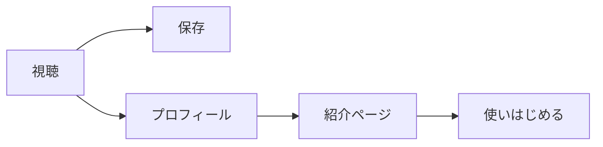

# SNS戦略

本書は saborine のSNS立ち上げ戦略である。目的は、広告費ゼロでSNSアカウントを育て、(1) 実際にアプリを使い始めるカップルを獲得すること、(2) 検証計画の仮説5(需要仮説)を検証することの2つに限定する。企画書(docs/product.md)の設計原則、とりわけ「誰も責めない」を、機能だけでなくコンテンツのトーンにも貫く。SNS上での saborine は「家事分担の正論を言うアカウント」ではなく、「ふたりの暮らしを映す鏡になる、だらしなくてかわいい犬」である。

なお、本書のうちアルゴリズムに関する記述は各プラットフォームの一次公表と運用各社の分析(末尾の References 参照)に基づく事実であり、数値目標や工数見積りは運用開始前の推測(仮置き)である。両者は本文中で明示的に区別する。

## Platform Strategy

工数が限られる前提で、最初の30日は TikTok を唯一の主戦場とし、Instagram Reels には同じ動画を転載するだけに留める。推薦の根拠は次の3点である。

1. コールドスタートに強い。TikTok はフォロワーゼロでもおすすめフィードで新規視聴者に届く設計であり、開設直後のアカウントに最も適する。Instagram のリールも最初からフォロワー外へ届くが、段階配信のためフォロワー基盤があるほど有利になる(出典: Instagram 2026年アルゴリズム解説各社)
2. カップル共同ペット文化の本場である。Widgetable の共同ペット機能や SUSH は TikTok 上で文化として拡散しており(SUSH 関連投稿は数百万件規模)、「ふたりで育てるキャラクター」という文脈を説明なしで理解する視聴者が既にいる(出典: TikTok 上の Widgetable / SUSH 関連投稿群)
3. 意思決定者に届く。インストールの意思決定者である20代の「する側」(多くは女性)は TikTok の中心層と重なる

各プラットフォームの役割分担を次のとおり定める。

| プラットフォーム | 優先度 | 役割 | 運用方針 |
| :-- | :-- | :-- | :-- |
| TikTok | 主戦場 | 新規発見とバズの起点。仮説5の検証もここで行う | 週4本の縦動画をネイティブ投稿する |
| Instagram(Reels) | 転載先 | 保存・見返し文化が強く、プロフィールからアプリへの導線が安定している | TikTok と同一動画を転載する(透かしなしで書き出す)。追加工数はほぼゼロ |
| Lemon8 | 転載先 | ユーザーの約86%が20〜30代女性で、ターゲットと一致する。TikTok とのアカウント連携で転載コストが低い(出典: Lemon8 解説各社) | 週次カード風の画像投稿を月2〜3回試す。伸びなければ撤退する |
| X | 補助 | 開発ログと個人開発コミュニティからの応援獲得。バズ狙いはしない | 制作の裏側を週1回つぶやく程度に留める |

判断の背景として、2026年時点の各プラットフォームの評価指標を押さえておく。TikTok は視聴完了率・保存数・コメント数を重視し、運用各社の分析では保存率が高い動画ほどおすすめ露出が伸びるとされる(一次公表値ではない)。Instagram は2026年時点でDMシェア(友だちに送る)の重みが最も大きいと解説されている。saborine のコンテンツは「パートナーにこれ送ろう」という DM シェアと相性が良く、この評価軸は追い風である。

## Content Pillars

コンテンツの柱は4本とする。すべての柱に共通する原則は、登場するのが常に「ふたりとサボリーヌ」であり、どちらか一方を悪者にする構図を一切作らないことである。笑いの対象は人ではなくサボリーヌに向ける。

| 柱 | 内容 | フォーマットと尺 | フック(最初の1秒) | 保存・共有の動機 |
| :-- | :-- | :-- | :-- | :-- |
| だらしな化ビフォーアフター | ふたりがサボるとサボリーヌがぐうたら・寝ぐせになり、どちらかの家事1回でしゃきっと戻る「飼い主の鏡」 | キャラクターアニメ+テロップ、15〜30秒 | 「ふたりがサボると、この犬はこうなります」と、だらしない姿を先に見せる | 「うちらのことじゃん」とパートナーへDMシェアする。アプリを入れる口実として最も自然な導線 |
| 家事あるある(責めない笑い) | 名もなき家事、実家基準の違い、「気づいた方がやる」の正体など、同棲1年目の共感ネタ | テロップ主体の静止画・簡易アニメ、10〜20秒 | 「『気づいた方がやる』は、気づく方がやるルール」のような一行の言語化 | 「わかる」の共感で保存し、あるあるの言語化としてパートナーや友人に共有する |
| ありがとうの瞬間 | 家事の記録に「ありがとう」が届き、ごはんになってサボリーヌが食べて喜ぶまでのループ | アプリ画面風の演出+キャラアニメ、20〜40秒 | ごはんを待つサボリーヌの顔から始める | 癒しとしての保存。「ありがとうがごはんになる」というコンセプトの記憶がそのまま使ってみる動機になる |
| 開発の裏側 | サボリーヌが生まれるまで。ラフ、SVG、動き付けの過程や名前の由来 | 画面収録+テロップ、30〜60秒 | 「サボる犬を、まじめに作っています」 | 個人開発の応援動機。「見守るファン」を作り、立ち上がりの初速を支える |

配分の目安は、だらしな化 4割、あるある 3割、ありがとう 2割、開発の裏側 1割とする。だらしな化はキャラクターの独自性そのものであり、伸びた場合に競合が真似できない唯一の柱であるため最も厚くする。

## Posting Calendar

最初の30日は TikTok に週4本(計16本前後)を投稿し、全本を Instagram Reels に転載する。品質より打席数を優先する。開設直後はどのフォーマットが伸びるか予測できないため、最初の2週間は4本の柱を満遍なく試し、後半2週間は反応の良かった柱に寄せる。

| 週 | 本数 | 配分方針 |
| :-- | :-- | :-- |
| 第1週 | 4本 | 4本の柱を1本ずつ。自己紹介を兼ねる |
| 第2週 | 4本 | 同じく満遍なく。フックの型(質問型・断言型・ビフォーアフター型)を変えて試す |
| 第3週 | 4本 | 前半で保存率上位だった柱に2本を寄せる |
| 第4週 | 4本 | 上位の柱に集中し、伸びた動画の続編・別アングルを作る |

具体的な投稿案10本を示す。各行はタイトル、フック、構成の順である。

| # | 柱 | タイトル / フック / 構成 |
| :-- | :-- | :-- |
| 1 | だらしな化 | 「ふたりがサボると、こうなる犬」/ だらしない寝姿を先出し / だらしな化の段階を早回し→家事1回でしゃきっと復活のオチ |
| 2 | あるある | 「『気づいた方がやる』の正体」/ 断言テロップ1行 / 気づくのはいつも同じ人、という構造をサボリーヌが寝ながら聞いている構図で笑いに変換 |
| 3 | ありがとう | 「ありがとうがごはんになる犬」/ 空の食器を見つめるサボリーヌ / 記録→ありがとう→ごはん→喜ぶ、のループを1周見せる |
| 4 | だらしな化 | 「寝ぐせがつく犬を飼っています」/ 寝ぐせのアップ / 寝ぐせの理由(ふたりがサボった)を明かし、直る条件(どちらかの家事1回)で締める |
| 5 | あるある | 「名もなき家事、言えるだけ言ってみた」/ 「ゴミ袋の補充、誰がやってる?」/ 名もなき家事を高速列挙し、最後に「ぜんぶ、ごはんになるよ」とサボリーヌが締める |
| 6 | あるある | 「『畳み方が違う』事件」/ 畳み直される洗濯物 / どちらの畳み方も正解としてサボリーヌが両方の上で寝るオチ。誰も責めないの象徴回 |
| 7 | 開発の裏側 | 「サボる犬を、まじめに作っています」/ ラフスケッチの束 / ラフ→SVG→動き付けの過程を早回しし、名前の由来で締める |
| 8 | ありがとう | 「片方が10回より、5回ずつの方が育つ」/ 「このアプリ、がんばるほど損します」/ バランスで育つ仕組みを図解し、「だから誘った方が早い」で締める |
| 9 | だらしな化 | 「復活の瞬間だけ集めました」/ しゃきっと戻る瞬間の連打 / だらしな→復活のカットを音ハメで連続再生する。リプレイ(繰り返し視聴)狙い |
| 10 | ありがとう | 「進化の3分岐、どれ推し?」/ 3つのシルエット / 調和系・花さき系・こつこつ系を順に見せ、コメントで推しを聞く。コメント誘発回 |

投稿時間は、ターゲットの生活動線に合わせて平日21〜23時、日曜の夜を基本とする(推測。開設後にインサイトで補正する)。

## Account Setup

アカウントは TikTok と Instagram で同一の名前・アイコン・世界観に統一する。プロフィールは「家事アプリの宣伝」ではなく「サボリーヌというキャラクターの飼育記録」として設計する。

| 項目 | 案 |
| :-- | :-- |
| アカウント名 | サボリーヌ｜ふたりで飼う犬(ハンドルは @saborine で統一) |
| プロフィール文 | ふたりがサボると、だらしなくなる犬です🐕 家事をすると「ありがとう」がごはんになります。いっしょに里親になってくれる人、募集中(下のリンクから すぐ会えます) |
| アイコン | サボリーヌの顔(通常時)。だらしな姿は投稿で見せ、アイコンは常にしゃきっとさせておく |
| 導線 | プロフィールのリンクをアプリの紹介ページへ向ける。動画の締めとコメント欄固定にも「プロフィールのリンクから里親になれるよ」を置く |

リンクの行き先は、メールアドレスを預かる事前登録の受付ではなく、アプリの紹介ページ(`/welcome`)とする。アプリはすでに動いており、名前を入れるだけで1分後にはサボリーヌと会える。後日の案内を待たせるより、その場で使い始めてもらう方が短く、しかも「登録したい」という意思ではなく「実際に使い始めた」という事実を測れる。プロフィールのリンクは、動画を出す前に必ず用意しておく。

開設作業のうちオーナー本人でなければできないものをチェックリストとして示す。

| 作業 | 必要なもの | 補足 |
| :-- | :-- | :-- |
| TikTok アカウント開設 | 電話番号またはメールアドレスの認証 | 開設後にビジネスアカウントへ切り替える。プロフィールへのリンク設置は個人アカウントではフォロワー1,000人の条件があるため、ビジネス切替で回避できるかを開設時に本人が確認する(要確認事項) |
| Instagram アカウント開設 | 電話番号またはメールアドレスの認証 | プロアカウント(クリエイター)へ切り替える。リンクは開設直後から設置できる |
| Lemon8 アカウント連携 | TikTok アカウント | TikTok とのアカウント連携を本人の操作で許可する |
| 紹介ページのURLの用意 | 公開済みのアプリ(独自ドメインは任意) | 紹介ページはアプリに含まれるため、作る作業は不要。流入元を測るため、TikTok用・Instagram用でパラメータ付きURLを分ける |
| ハンドルの確保 | 上記アカウント | @saborine が取れない場合の代替(@saborine_app 等)の決裁 |

## Production

キャラクター素材は MVP の SVG を流用し、動画専用の作画はしない。現実的なパイプラインは次のとおりである。

1. 素材書き出し: SVG から表情・ポーズ差分(通常・ぐうたら・寝ぐせ・食事・喜び、各1枚)を透過PNGで書き出す。差分は最初に5枚だけ作り、使い回す
2. 動き付け: CapCut(無料)でキーフレームアニメ(ゆらす・跳ねる・ズーム)を付ける。口パクや骨格アニメは作らず、静止画の弾みとカット割りで「動いて見える」水準を狙う。Widgetable / SUSH 系の拡散動画もこの水準が主流である
3. 仕上げ: テロップ、効果音、トレンド音源を CapCut 内で載せ、透かしなしで書き出して TikTok と Instagram に別々にアップする
4. 将来: Rive 導入後はアプリ実機の画面収録がそのまま動画素材になり、工数が大きく下がる。それまでは上記の擬似アニメで代替する

1本あたりの目安工数(推測)を柱ごとに示す。

| 柱 | 目安工数 | 内訳 |
| :-- | :-- | :-- |
| だらしな化ビフォーアフター | 60〜90分 | 差分の組み合わせ+キーフレーム+音ハメ |
| 家事あるある | 30〜45分 | テロップ主体。キャラは1〜2カットのみ |
| ありがとうの瞬間 | 60〜90分 | アプリ画面風の演出を含むため差分が多い |
| 開発の裏側 | 30〜45分 | 画面収録の切り貼り+テロップ |

週4本の合計はおおむね週4〜5時間であり、開発と並行して1人で維持できる上限として設計している。これを超える演出(フル作画・実写企画)は伸びが証明されるまで行わない。

## KPI

開設1ヶ月で見るのは、仮説5「サボリーヌのコンテンツは、広告なしでもSNSで見つけてもらい、実際に使い始める人につながる」の判定材料である。ファネルは次のとおり単純化する。

計測する指標と、仮説5の成功基準「開設後に基準化する」の具体案を示す。基準化の方法は、第2週終了時点で全投稿の保存率とプロフィール遷移率の中央値をベースラインとして確定し、第3〜4週の投稿がベースラインをどれだけ超えるかで需要の所在(どの柱に需要があるか)を判定する、というものである。絶対値の目標は開設前の推測(仮置き)であることを明記する。

| 指標 | 定義 | 30日の仮置き目標 | 判定の意味 |
| :-- | :-- | :-- | :-- |
| 保存率 | 保存数 ÷ 再生数 | ベースライン確定後、いずれかの柱で 3% 超の動画が2本以上 | 「あとで使う・人に見せる」価値の証明。柱の優劣判定に使う主指標 |
| 平均視聴完了率 | 最後まで見た割合 | 30% 以上(15〜30秒の短尺前提) | フックと尺の妥当性 |
| フォロワー | 30日時点の合計 | 300〜1,000 のレンジで観測 | 絶対値より、伸びた動画の翌日に増えるかという連動性を見る |
| プロフィール遷移→紹介ページ到達 | パラメータ付きURLで計測(Cloudflare Web Analytics) | 週次で増加傾向 | コンテンツと導線の接続確認 |
| 使いはじめた人 | 表示名の登録を終えた数 | 30日で30人 | 仮説5の最終指標。紹介ページ到達→登録の転換率が 40% を下回る場合はSNSではなく紹介ページの問題と切り分ける |

30日終了時の判定は3択とする。いずれかの柱でベースラインの2倍を超える動画が複数出て利用開始が発生していれば「継続・その柱に集中」、視聴は伸びるが登録が発生しなければ「導線と紹介ページの作り直し」、全柱でベースライン自体が極端に低い(保存がほぼ発生しない)場合は「コンテンツの型のピボット」を選ぶ。1ヶ月で需要仮説そのものを棄却する判断はしない。オーガニック運用の立ち上がりには複数月かかるのが通例であり、30日は「どの型に反応があるか」を知るための期間と位置づける。

## Guardrails

炎上リスクの大半は「家事分担」という題材そのものに埋まっている。この領域のバズは男女対立を燃料にすることが多いが、saborine は設計原則によりその燃料を使えないし、使わない。SNS版の「責めない」原則として、次を恒久的に守る。

| やらないこと | 理由 |
| :-- | :-- |
| 「旦那が/彼女が○○してくれない」型のフォーマットに乗らない | 短期では伸びるが、片側を悪者にする構図はプロダクトの存在意義と矛盾する。招待される側(しない側)が敵視されたと感じた瞬間、両面採用が崩れる |
| 男女の統計で片側を批判する投稿をしない | 企画書の調査データは課題定義に使うものであり、SNSで人を裁く道具にしない |
| 特定の家事のやり方を正解・不正解で裁かない | 「畳み方が違う」問題はネタにしてよいが、オチは常に「どちらも正解」に落とす |
| 回数・スコアの比較を想起させる表現をしない | 「あなたは何回?」型の煽りはアプリ内で禁じた「恨みの帳簿」のSNS版である |
| 誇張した効果訴求(喧嘩がなくなる・関係が治る等)をしない | 治療効果めいた約束は反発と失望を生む。約束するのは「かわいい」と「ありがとうが増える」まで |
| 対立を煽るコメントに反論しない | 議論に参加せず、返信する場合はサボリーヌのキャラクターとして和ませる一言のみ返す。加熱した場合は返信せず放置する |

迷ったときの判定基準は1つでよい。「この投稿を、招待される側(大樹)が見たときに、責められたと感じるか」。感じる可能性があるなら投稿しない。

## References

事実として引用した主な出典を示す。アルゴリズムの数値(保存率と露出の関係、DMシェアの重み等)は各プラットフォームの一次公表ではなく運用会社の分析であるため、傾向として扱い、絶対値の根拠にはしない。

- TikTok 2026年アルゴリズム解説: [pamxy](https://pamxy.co.jp/marke-driven/sns-marketing/tiktok-algorithm/)、[アンドゼン](https://andthen.co.jp/blog/tiktok-algorithm/)(視聴完了率・保存数・コメント数の重視、保存率と露出の相関)
- Instagram 2026年アルゴリズム解説: [comnico](https://www.comnico.jp/we-love-social/ig-algorithm)、[tatap](https://tatap.jp/knowledge/instagram-reel-185/)(DMシェアの重み、リールの段階配信とフォロワー外リーチ)
- Widgetable 共同ペット文化: [Widgetable 公式 TikTok](https://www.tiktok.com/@widgetable/video/7577770273844284702) ほか関連投稿群
- SUSH の拡散事例: [SUSH 公式 TikTok](https://www.tiktok.com/@sush_app) と関連ハッシュタグ投稿群(数百万件規模)
- Finch の成長構造: [Sparrow Apps 分析](https://blog.sparrowapps.io/p/finch-how-a-self-care-app-hit-30m-arr-without-vc-money)、[Chief Marketer](https://www.chiefmarketer.com/finchs-first-brand-campaign-celebrates-the-weirder-side-of-self-care/)(口コミとコミュニティ主導の初期成長。ただし現在は広告も併用しており「完全オーガニックの前例」ではない点に注意)
- Lemon8 の日本ユーザー構成: [Shinker](https://shinker.co.jp/lemon8/) ほか解説各社(女性比率約86%、TikTok 連携)
